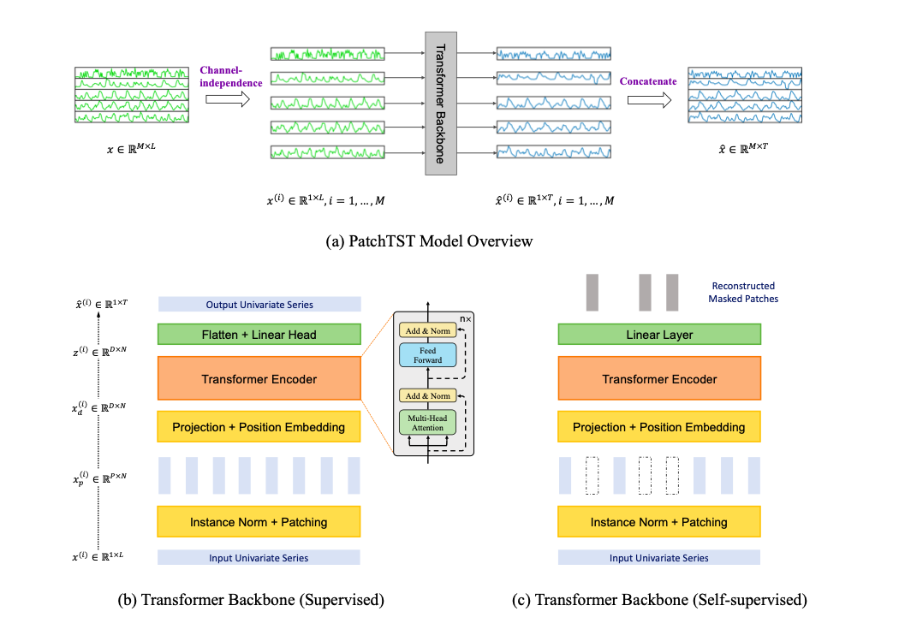

# Análisis de Forecasting para Series Temporales Financieras


## Descripción del Proyecto

**Índice bursàtil:** NASDAQ 100 (National Association of Securities Dealers Automated Quotation). Es la segunda bolsa de valores electrónica automatizada más grande de Estados Unidos. Se caracteriza por comprender las empresas de alta tecnología en electrónica, informática, telecomunicaciones, biotecnología, etc.

**Sector:** Sector Tecnológico

**Horizonte temporal:** 

**Empresas elegidas:** La siguiente lista son las 50 empresas más tecnológicas dentro del índice NASDAQ 100. 

- Apple Inc. (AAPL)
- Microsoft Corporation (MSFT)
- Amazon.com Inc. (AMZN)
- Alphabet Inc. Class A (GOOGL)
- Meta Platforms, Inc. (FB)
- Tesla, Inc. (TSLA)
- NVIDIA Corporation (NVDA)
- Adobe Inc. (ADBE)
- PayPal Holdings, Inc. (PYPL)
- Netflix, Inc. (NFLX)
- Intel Corporation (INTC)
- Cisco Systems, Inc. (CSCO)
- Broadcom Inc. (AVGO)
- Qualcomm Incorporated (QCOM)
- Advanced Micro Devices, Inc. (AMD)
- Zoom Video Communications, Inc. (ZM)
- Texas Instruments Incorporated (TXN)
- Applied Materials, Inc. (AMAT)
- ASML Holding N.V. (ASML)
- Micron Technology, Inc. (MU)
- NXP Semiconductors N.V. (NXPI)
- KLA Corporation (KLAC)
- Intuit Inc. (INTU)
- Marvell Technology, Inc. (MRVL)
- Western Digital Corporation (WDC)
- Skyworks Solutions, Inc. (SWKS)
- Cadence Design Systems, Inc. (CDNS)
- Analog Devices, Inc. (ADI)
- Lam Research Corporation (LRCX)
- Xilinx, Inc. (XLNX)
- Seagate Technology Holdings plc (STX)
- Synopsys, Inc. (SNPS)
- Fortinet, Inc. (FTNT)
- Cognizant Technology Solutions Corporation (CTSH)
- Autodesk, Inc. (ADSK)
- Workday, Inc. (WDAY)
- DocuSign, Inc. (DOCU)
- Palo Alto Networks, Inc. (PANW)
- ServiceNow, Inc. (NOW)
- Splunk Inc. (SPLK)
- Okta, Inc. (OKTA)
- Zebra Technologies Corporation (ZBRA)
- Teradyne, Inc. (TER)
- Atlassian Corporation Plc (TEAM)
- Fiserv, Inc. (FISV)
- Citrix Systems, Inc. (CTXS)
- Align Technology, Inc. (ALGN)
- Synopsys, Inc. (SNPS)
- Microchip Technology Incorporated (MCHP)
- Mettler-Toledo International Inc. (MTD)


### Modelos

**AutoArima**

**Prophet**

**Chronos**


**PatchTST**



## Métricas de evaluación

**Error Absoluto Medio (MAE)**

El MAE se calcula como el promedio de los valores absolutos de los errores entre las predicciones y los valores reales. Es útil porque da una idea de cuán grande es el error promedio del modelo en las mismas unidades que los datos originales.


**Error Cuadrático Medio (MSE)**

El MSE es otra métrica común que calcula el promedio de los errores al cuadrado entre las predicciones y los valores reales. Es útil porque penaliza más los errores grandes debido al cuadrado en la fórmula.


## Requisitos

- Python 3.x
- Bibliotecas de Python:
  - pandas
  - numpy
  - matplotlib
  - scikit-learn
  - statsmodels
  - fbprophet

## Instalación

1. Clona este repositorio en tu máquina local:

```bash
git clone https://github.com/Marcos-Heredia-98/GenerativeAI_TimeSeries.git
